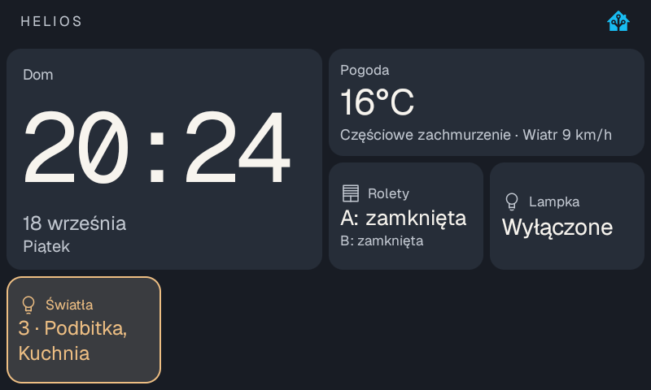

# Helios - a Home Assistant face for the Lenovo Smart Clock 2

Helios turns a Lenovo Smart Clock 2 into a Home Assistant wall panel: a 4x3
dashboard configured entirely from Home Assistant, local "Okay Nabu" wake word
into the HA Assist pipeline, and the clock as a Music Assistant player.

It is a sideloaded Android launcher for one specific piece of hardware. It does
not need Google's services, does not replace your default launcher unless you
ask it to, and talks to nothing but your own Home Assistant.



## What it does

- **Dashboard from Home Assistant.** A 4x3 grid of tiles - clock, weather,
  entity readouts, lights, covers, a garage door, a music tile - described in
  the `helios` section of a Lovelace dashboard. Saving the YAML re-renders the
  clock; no new APK. Tiles can be conditional on any HA entity state. Tapping a
  light toggles it, a cover opens a panel, a lights tile can turn a whole group
  off after a confirmation. The clock only ever calls `light.toggle`,
  `light.turn_off` and the three `cover.*` services, never a service name that
  came out of the YAML. See [docs/ha-dashboard.md](docs/ha-dashboard.md).
- **Voice.** Always-on local wake word detection ("Okay Nabu", microWakeWord
  ARMv7 engine with a pinned model). Nothing is recorded or sent before the
  wake word fires; then the microphone streams to the HA Assist pipeline over
  the same WebSocket. The clock's hardware microphone switch is the mute
  control. Follow-up turns stay in the same conversation for a few seconds.
- **Music Assistant.** The clock registers as a local Sendspin player (48 kHz
  PCM) and can also drive your other players: a library browser with search and
  recent items, a slide-out now-playing panel, and a full-screen player.
  Assist ducks or pauses the music while you talk.
- **A device in Home Assistant.** The companion integration
  [SychPL/ha-helios](https://github.com/SychPL/ha-helios) creates a device with
  sensors (app version, voice state, dock), a light for the dock lamp, a volume
  number and a media player. Assigning the device to an area gives your voice
  commands room context.
- **Pairing without tokens.** The clock finds Home Assistant over mDNS (or you
  type the address), Home Assistant shows a six-digit code, and the integration
  mints the clock its own non-admin, local-only user. No long-lived admin token
  ever touches the device. See [docs/SPEC-0.10-onboarding.md](docs/SPEC-0.10-onboarding.md).

## Hardware and firmware

Built and verified on a **Lenovo Smart Clock 2** (MT8167, Android 10), retail
firmware `LenovoCD-24502F_ROW_1.2.2.627_220105`. The dock lamp and phone
charging detection use the OEM binder service of the Lenovo charging dock, so
those two features need the dock; everything else works without it.

The clock ships with no launcher, no browser and no ADB. Getting an APK onto it
for the first time is the hard part, and it is covered in
**[docs/INSTALL.md](docs/INSTALL.md)** - either with ADB over Wi-Fi via
[smartclock2tool](https://github.com/SychPL/smartclock2tool), or with the
TalkBack trick that needs no cable and no root.

## Install

1. Get an APK onto the clock - [docs/INSTALL.md](docs/INSTALL.md).
2. Install the Home Assistant integration from HACS as a custom repository:
   `https://github.com/SychPL/ha-helios`, then restart Home Assistant.
3. Pair: on the clock pick your Home Assistant, in Home Assistant add the
   **Helios** integration, type the six-digit code on the clock.
4. Optional: publish a dashboard. The `ha/` directory holds example manifests
   and `tools/` holds the publishers. Read
   [docs/ha-dashboard.md](docs/ha-dashboard.md) first - the manifests describe
   one particular home and are meant to be edited, not deployed as they are.

Full walkthrough with screenshots: [docs/ha-integration.md](docs/ha-integration.md)
(Polish; an English summary is in [docs/INSTALL.md](docs/INSTALL.md)).

## Build

```bash
export JAVA_HOME="/path/to/jbr"        # the JDK that ships with Android Studio
./gradlew testDebugUnitTest assembleDebug lintDebug
```

`local.properties` points at your Android SDK; platform 35 and build-tools
36.0.0 are needed. The result is `app/build/outputs/apk/debug/app-debug.apk`.
Java 8 language level, minSdk and targetSdk 29, no AndroidX - the clock runs
Android 10 and the app is deliberately small and old-fashioned.

The wake-word model, the ARMv7 engine and the fonts are vendored with their
licenses and SHA-256 provenance under `app/src/main/assets/` and
`app/src/main/jniLibs/`.

## Status and scope

This is a personal project that happens to be useful. It is verified on exactly
one clock, one Home Assistant (2026.8.3) and one Music Assistant (2.10.3). The
protocol between the app and the integration is versioned and both sides refuse
mismatched versions, but there is no compatibility promise across releases yet.

Documentation is mostly in Polish: the specifications under `docs/` (`SPEC-*`)
are the authoritative description of every feature, and `docs/INSTALL.md` plus
this README are the English entry points. Issues and pull requests in English
are welcome.

## Licensing

Apache License 2.0 - see [LICENSE](LICENSE) and [NOTICE](NOTICE). The app
vendors code and a model from the Home Assistant Android companion app under
the same license; attribution and provenance are in `NOTICE` and in the
`provenance.json` files next to the vendored assets.

## Related repositories

- [SychPL/ha-helios](https://github.com/SychPL/ha-helios) - the Home Assistant
  integration (HACS).
- [SychPL/smartclock2tool](https://github.com/SychPL/smartclock2tool) - root,
  ADB over Wi-Fi and SSH on the Smart Clock 2, and the install trick that needs
  neither.

The Polish README that documented the 0.5 to 0.8 development is kept as
[README.pl.md](README.pl.md).
